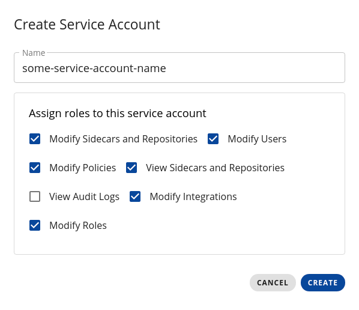
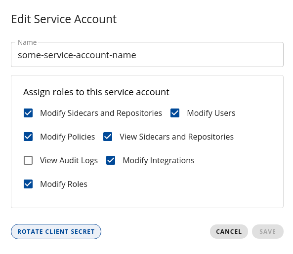

# Cyral Terraform Provider

The Cyral Terraform Provider contains resources that can be used to interact with the Cyral API through Terraform code. It allows customers to maintain a history of changes in Cyral environment by transforming configurations into code and use Terraform to control state changes.

Our provider uses the same naming conventions and organization as stated in Terraform guidelines for [writing custom providers](https://www.terraform.io/docs/extend/writing-custom-providers.html).

## Change Log

The [Change Log](CHANGELOG.md) keeps track of features, bug fixes and Control Plane compatibility of this provider.

## Compatibility

This provider is compatible with both Auth0 or Keycloak-based CPs. Some initial setup is needed in both Auth0 and Keycloak as stated in the next sections.

### Auth0

1. Open Auth0 dashboard;
2. Select `Applications` and hit `Create application`;
    1. Choose `Machine to Machine Applications`;
    2. Select the API `https://cyral-api.com`;
    3. Select scopes: `read:users`;
    4. Finish the creation by clicking `Authorize`;
3. In the application just created, access `Settings` and copy `Client ID` and `Client Secret`. Use these parameters to set up the provider. See the [provider](./docs/provider.md) documentation how to set those two parameters.

### Keycloak (Control planes from v2.22 onwards)

#### New Credentials

A `Service Account` must be created in order to use the provider. It can be created through the control plane UI, accessing the `Service accounts` section in the left menu and clicking on the `+` button. Choose a name for the new service account and select the following roles so you can use all the provider functions:



Confirm the account creation by clicking on the `CREATE` button. This will generate a `Client ID` and a `Client Secret` that should be used in the [provider configuration](./docs/provider.md).

#### Rotate Credentials

To rotate secrets for existing service accounts, select a specific service account in the UI, and then click on the button `ROTATE CLIENT SECRET` as the image below suggests:



That will generate a new `Client Secret` that you can copy and use to replace the old one.

### Keycloak (Control planes up to v2.22)

#### New Credentials

A `Service Account` must be created in order to use the provider. It can be created by the [script provided in the scripts folder](./scripts/create-keycloak-service-account.sh). You can run it with the command below:

```bash
curl https://raw.githubusercontent.com/cyralinc/terraform-provider-cyral/main/scripts/create-keycloak-service-account.sh -O
bash create-keycloak-service-account.sh
```

#### Rotate Credentials

[This script](./scripts/rotate-keycloak-service-account-secret.sh) can be used to rotate secrets for existing service accounts. It can be rotated by running the command below:

```bash
curl https://raw.githubusercontent.com/cyralinc/terraform-provider-cyral/main/scripts/rotate-keycloak-service-account-secret.sh -O
bash rotate-keycloak-service-account-secret.sh
```

## Usage

The code below is just a simple example of how to use the Cyral Terraform Provider with Terraform `v0.13+`. Refer to the "Supported Elements" section for more details on data sources, resources and the provider itself.

```hcl
terraform {
  required_providers {
    cyral = {
      source = "cyralinc/cyral"
    }
  }
}

provider "cyral" {
    client_id = "some-client-id"
    client_secret = "some-client-secret"
    control_plane = "some-cp.cyral.com:8000"
}

resource "cyral_repository" "mongodb_repo" {
    type = "mongodb"
    host = "mongodb.cyral.com"
    port = 27017
    name = "mymongodb"
}

resource "cyral_repository" "mariadb_repo" {
    type = "mariadb"
    host = "mariadb.cyral.com"
    port = 3307
    name = "mymariadb"
}

resource "cyral_integration_elk" "elk" {
    name = "my-elk-integration"
    kibana_url = "kibana.local"
    es_url = "es.local"
}

resource "cyral_integration_datadog" "datadog" {
    name = "my-datadog-integration"
    api_key = "datadog-api-key"
}

resource "cyral_sidecar" "my_sidecar_name" {
    name = "mysidecar"
    deployment_method = "cloudFormation"
}

resource "cyral_sidecar_credentials" "my_sidecar_credentials_name" {
  sidecar_id = cyral_sidecar.my_sidecar_name.id
}

locals {
    repositories = [cyral_repository.mongodb_repo, cyral_repository.mariadb_repo]
}

resource "cyral_repository_binding" "repo_binding" {
    count         = length(local.repositories)
    repository_id = local.repositories[count.index].id
    listener_port = local.repositories[count.index].port
    sidecar_id    = cyral_sidecar.my_sidecar_name.id
}

resource "cyral_datamap" "my_datamap_name" {
    mapping {
        label = "CCN"
        data_location {
            repo = cyral_repository.mongodb_repo.name
            attributes = ["applications.customers.credit_card_number"]
        }
    }
}
```

## Supported Operations

Terraform Cyral Provider was designed to be compatible with all existing Terraform operations. Thus it supports `apply`, `destroy`, `graph`, `import`, `refresh`, `show`, `taint`, `untaint`, etc.

### Import

Import operation identifies resources using property `name`. Thus, if you need to import the state of the resource `cyral_repository.my_resource_name` shown above, you will run:

```shell
terraform import cyral_repository.my_resource_name myrepo
```

## Supported Elements
- [Data Source SAML Certificate](./docs/data_source_saml_certificate.md)
- [Data Source Sidecar CFT Template](./docs/data_source_sidecar_cft_template.md)
- [Data Source SAML Configuration](./docs/data-sources/saml_configuration.md)
- [Provider](./docs/provider.md)
- [Resource Datamap](./docs/resource_datamap.md)
- [Resource Integration Datadog](./docs/resource_integration_datadog.md)
- [Resource Integration ELK](./docs/resource_integration_elk.md)
- [Resource Integration Hashicorp Vault](./docs/resource_integration_hc_vault.md)
- [Resource Integration Logstash](./docs/resource_integration_logstash.md)
- [Resource Integration Looker](./docs/resource_integration_looker.md)
- [Resource Integration Okta](./docs/resource_integration_okta.md)
- [Resource Integration Microsoft Teams](./docs/resource_integration_microsoft_teams.md)
- [Resource Integration Pager Duty](./docs/resource_integration_pager_duty.md)
- [Resource Integration Slack Alerts](./docs/resource_integration_slack_alerts.md)
- [Resource Integration Splunk](./docs/resource_integration_splunk.md)
- [Resource Integration SSO AAD](./docs/resources/integration_sso_aad.md)
- [Resource Integration SSO ADFS](./docs/resources/integration_sso_adfs.md)
- [Resource Integration SSO Forgerock](./docs/resources/integration_sso_forgerock.md)
- [Resource Integration SSO GSuite](./docs/resources/integration_sso_gsuite.md)
- [Resource Integration SSO Okta](./docs/resources/integration_sso_okta.md)
- [Resource Integration SSO Ping One](./docs/resources/integration_sso_ping_one.md)
- [Resource Integration Sumo Logic](./docs/resource_integration_sumo_logic.md)
- [Resource Policy](./docs/resource_policy.md)
- [Resource Policy Rule](./docs/resource_policy_rule.md)
- [Resource Repository](./docs/resource_repository.md)
- [Resource Repository Analysis Configuration](./docs/resource_repository_conf_analysis.md)
- [Resource Repository Authentication Configuration](./docs/resource_repository_conf_auth.md)
- [Resource Repository Binding](./docs/resource_repository_binding.md)
- [Resource Repository Identity Map](./docs/resource_repository_identity_map.md)
- [Resource Repository Local Account](./docs/resource_repository_local_account.md)
- [Resource Sidecar](./docs/resource_sidecar.md)
- [Resource Sidecar Credentials](./docs/resource_sidecar_credentials.md)

## Configuration Templates

See below a list of configuration templates that can be used to deploy some predefined scenarios:

- [Add native repository credentials to AWS Secrets Manager](./docs/templates/native_credentials_aws_sm.md)


## Prerequisites

Our existing provider supports Terraform `v0.12`, `v0.13` and `v0.14`. There are special actions to be taken in order to use this provider with Terraform `v0.12` as described in the `Deployment` section.

## Build Instructions

In order to build and distribute this provider, follow the steps below:

 1. Clone [terraform-provider-cyral](https://github.com/cyralinc/terraform-provider-cyral) repo from GitHub;

 2. Go to the root directory of the cloned repo using Linux shell and execute `make`. The build process will create binaries in directory `out` for both `darwin` and `linux` 64 bits. These binaries will be copied automatically to the local Terraform registry to be used by Terraform 13 and 14.

Alternatively, you can use the dockerfile to build the image using `make docker-compose/build`

To use the local provider, the module must be configured to use the local provider path as follows:
```hcl
terraform {
  required_providers {
    cyral = {
      source = "local/terraform/cyral"
    }
  }
}
```

## Test Instructions

The test framework requires basic configuration before it can be executed as follows:

1. Set the configuration environment variables:

```bash
# Set the control plane DNS name and port (default 8000):
export CYRAL_TF_CP_URL=mycp.cyral.com:8000

# Set Keycloak client and secret ID:
export CYRAL_TF_CLIENT_ID=?
export CYRAL_TF_CLIENT_SECRET=?

# Initialize Terraform acceptance tests variable
export TF_ACC=true
```

2. Run `make`

## Deployment

### Terraform v0.12

Copy the desired binary file created in directory `out` (see "Build Instructions") to the root folder containing those `.tf` files that will be used to handle Cyral Terraform provider resources.

Run `terraform init` and proceed with `terraform apply` normally to execute your Terraform scripts.

### Terraform v0.13 and v0.14

If you **are** running the provider with the same user and machine you built the provider using steps in `Build Instructions`, you should just run `terraform init` and proceed with `terraform apply` normally to execute your Terraform scripts.

If you **are not** running the provider with the same user *or* are not in the same machine that you built the provider, you must copy the binaries in directory `out` to the local registry as follows:

```bash
cd terraform-provider-cyral
cp out/${OS_ARCH}/${BINARY} ~/.terraform.d/plugins/cyral.com/terraform/cyral/${VERSION}/${OS_ARCH}
```

Where:
* **OS_ARCH** corresponds to the distribution (`darwin_amd64` or `linux_amd64`);
* **BINARY** corresponds to the binary name. Ex: `terraform-provider-cyral_v0.1.0`;
* **VERSION** corresponds to the version number withouth `v`. Ex: `0.1.0`.

